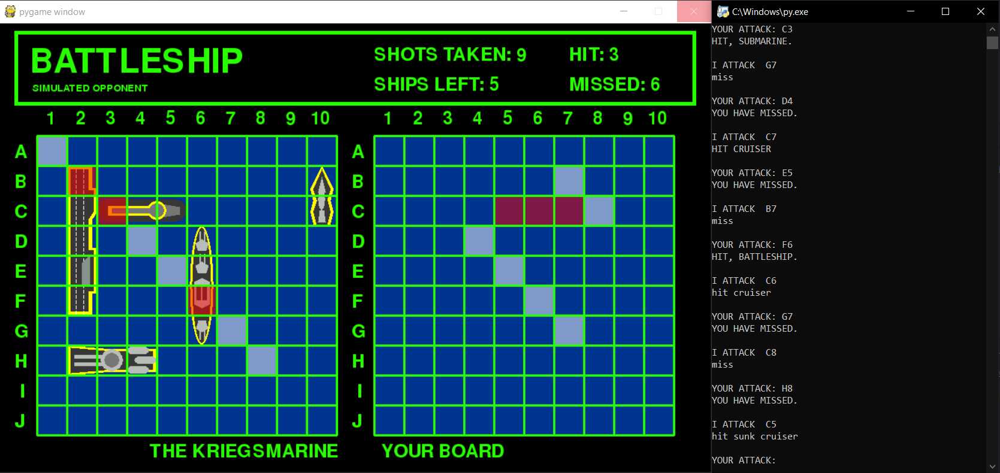

<h1>Battleship</h1>
This is a Pygame program that allows you to play battleship against a simulated opponent. The program was designed to test battleship algorithms, as such the opponent's board is revealed to the user and the program only expects correct interaction.
<h2>Key Features</h2>
<ul>
<li>10x10 battleship board played using 5 ships:</li>
  <ul>
    <li>Destroyer - Size 2</li>
    <li>Submarine - Size 3</li>
    <li>Cruiser - Size 3</li>
    <li>Battleship - Size 4</li>
    <li>Carrier - Size 5</li>
  </ul>
<li>Opponent uses probability to determine the best spot to shoot.</li>
<li>Opponent will cleverly sink ships that have been hit.</li>
</ul>
<h2>How to use</h2>
<ul>
<li>Use terminal to play</li>
<li>Initially, the user will be asked whether they want to go first or second, after which the game begins.</li>
<li>To shoot at a position, denote it as the row letter followed by the column number (E.g. E5).</li>
<li>When the opponent shoots:</li>
  <ul>
    <li>Enter "miss" if the opponent did not hit a ship.</li>
    <li>Enter "hit" if the opponent hit a ship, followed by the respective ship name, and "sunk" if the ship has been sunk</li>
  </ul>
</ul>
<h2>Images</h2>

