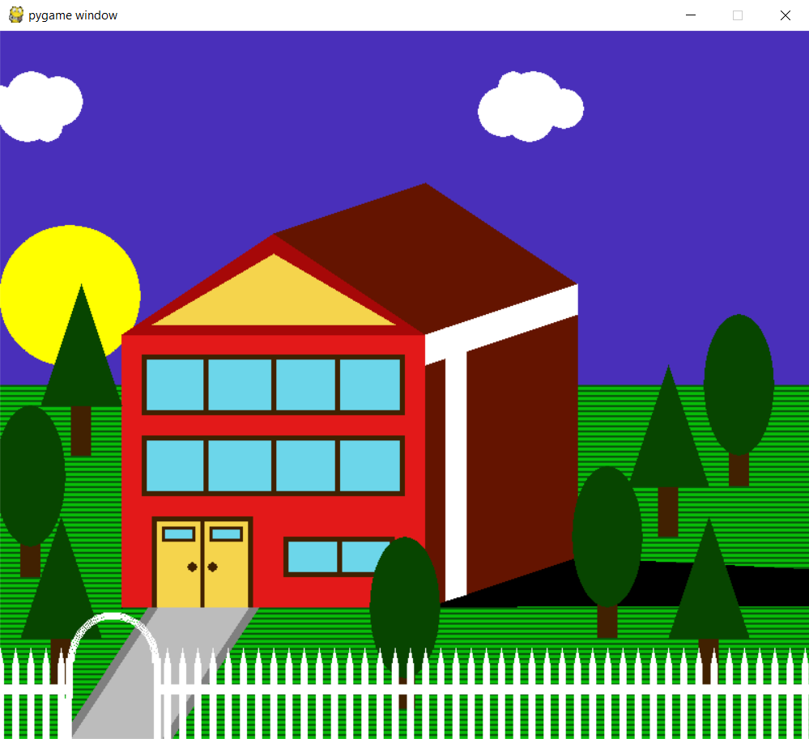

<h1>Pygame House</h1>
This is a Pygame program that displays a looped animation of a house.
<h2>Key Features</h2>
<ul>
<li>Usage of various geometric shapes to draw the house and landscape.</li>
<li>Animation of certain objects such as clouds, the sun, shadows, and the colour of the sky.</li>
</ul>
<h2>Images</h2>

