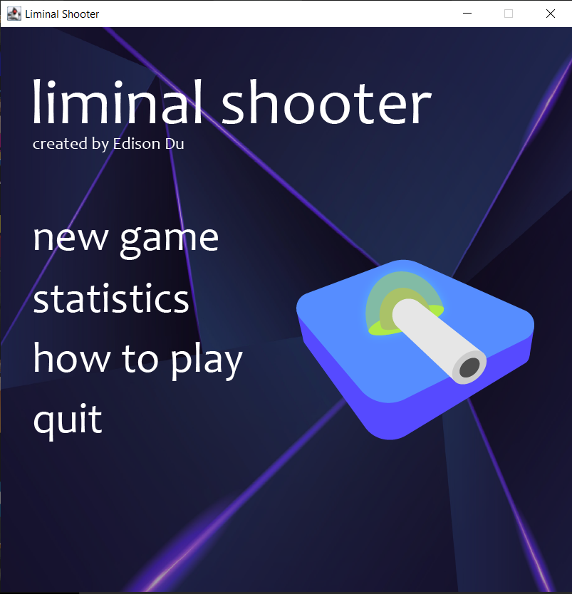
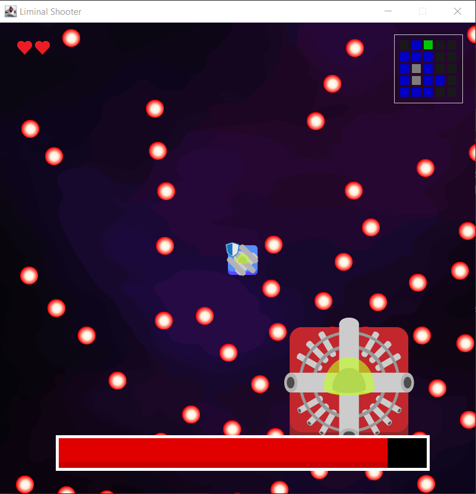

<h1>Liminal Shooter</h1>
This is a top-down dungeon crawler type shooter game created in Java.
<h2>Key Features</h2>
<ul>
<li>A menu system.</li>
<li>Player movement, shooting, and interactions through keyboard and mouse.</li>
<li>Fight various different enemies that can shoot, and can efficiently pathfind around walls to reach the player.</li>
<li>A randomly generated room system that can be explored by the player.</li>
<li>A boss that can be reached after obtaining certain items. The boss has unique attack patterns.</li>
</ul>
<h2>How to Use</h2>
<ul>
<li>Compile and run with Java. The main program is located in "GameFrame.java".</li>
<li>Once run, use mouse to interact with the menu. There is a help page explaining how to play the game.</li>
</ul>
<h2>Images</h2>
<table>
  <tr>
    <td></td>
    <td></td>
    <td></td>
  </tr>
</table>
